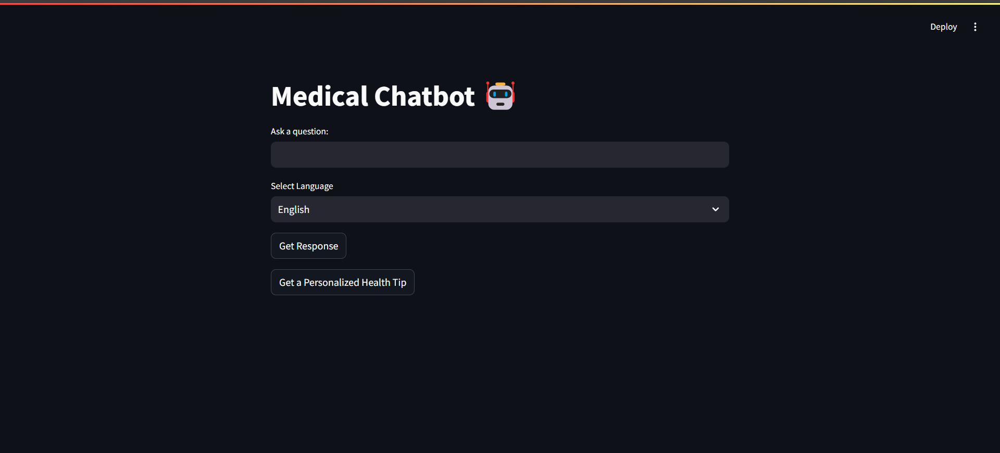
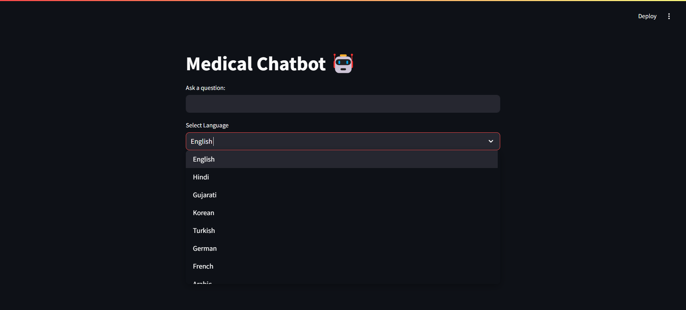
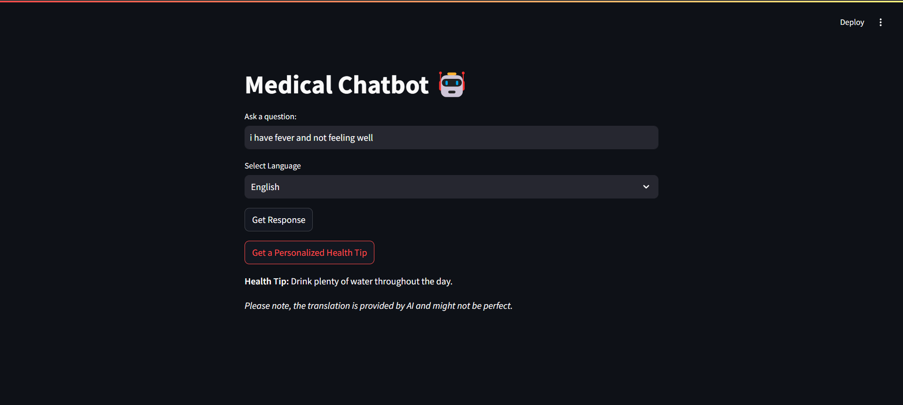

# AI-Health-Assistant
AI-powered Medical Chatbot 🤖 that provides health advice, disease-symptom analysis, and multilingual support using NLP and machine learning. It helps users receive personalized recommendations and health tips in multiple languages.

🚀 Features

Disease-Symptom-Cure Analysis:
Leverages a medical dataset to provide accurate analysis of symptoms, potential diseases, and recommended remedies.

Personalized Health Tips:
Offers tailored advice for better well-being based on user inputs and health queries.

Multilingual Support:
Supports multiple languages to ensure global accessibility and inclusivity.

AI-Based Response Generation:
Utilizes advanced NLP models (e.g., MedAlpaca-7B) to generate context-aware and reliable responses.

User-Friendly Interface:
Built with Streamlit, providing an intuitive and interactive experience for users.

🛠️ Technologies Used

Natural Language Processing (NLP):
Powered by the MedAlpaca-7B model for medical-specific language understanding and response generation.

Machine Learning:
Uses PyTorch and Hugging Face Transformers for model inference and optimization.

Streamlit:
For building a seamless and interactive web-based interface.

Multilingual Support:
Enabled through advanced tokenization and google translator api.

## 📸 Screenshots

### Main Screen
  
*The main interface of the Medical Chatbot.*

### Language Dropdown
  
*Dropdown menu showing supported languages.*

### Suggestions in English
  
*Example of health suggestions provided in English.*

### Suggestions in Gujarati
  
*Example of health suggestions provided in Gujarati.*

### Health Tip in English
  
*Example of a health tip provided in English.*


🌍 Multilingual Support

Our chatbot is equipped with multilingual capabilities, allowing it to respond in various languages. Simply input your query, and the chatbot will provide an answer in the language of your choice.

🙏 Acknowledgments

MedAlpaca-7B: For providing the medical-specific language model.

Hugging Face: For the Transformers library and model hosting.

Streamlit: For the easy-to-use web framework.

Google Translate API: For enabling multilingual support and translations.


## 🛠️ Installation
1. Clone the repository:
   ```bash
   git clone https://github.com/HarshNsingh001/AI-Health-Assistant.git 
2. pip install -r requirements.txt
3. streamlit run chat.py

